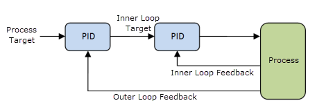
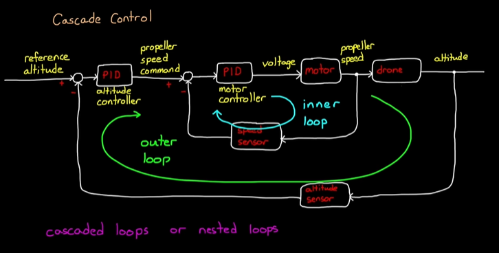

# Q1. Controlling Chaos  
## Part A:  

commanded variable / reference input: is the desired value we want the system to achieve

error term: is the difference between the desired value and the actual value

system/(plant/process): the system/(part of the system) being controlled

controller: the component determining the control action based on the error term

actuator: the component that applies the control action to the system

sensor: measures the observed variable (actual output) of the system

disturbance: external influence that affects the system's behavior 

observed variable / actual output: is the actual value produced by the system (representing process variables)

state: the exact condition of the system that may not be directly observable

>A control system works by continuously monitoring the observed variable through sensors, comparing it to the commanded variable to compute the error term. The controller processes this error to determine the appropriate control action, which is then exectured by the actuator to influence the system. The goal is to minimize the error and achieve the desired output, while accounting for disturbances and system dynamics.

**Open-Loop Control**

 **Definition**

An **open-loop control system** has **no feedback**.  
 The controller does **not** know what the output actually is. 

Control Action→Plant→Output

**1\. Washing Machine**

* Controller runs motor for fixed durations, and predefined cycles
* No sensing of cleanlines

**Justification:**

* Clothes usually within expected dirt range
* Adding sensors increases cost
* Sensors would be complex
* Exact cleanliness subjective

**Assumptions:**

* Typical load size
* Typical dirt level
* Known motor behavior

**2\. Bread Toaster**

* Heating for a fixed time
* No sensing of toastiness

**Justification:**

* manufactured bread is pretty uniform
* Cheap and reliable  
* No need for high precision

**Assumptions:**

* Typical bread type
* Typical external conditions (e.g., room temp, humidity)
* Known heater behavior

Open-loop control is chosen when:

* System dynamics are **well-known**  
* Disturbances are **small**  
* Precision is **not critical**  
* Cost, simplicity, or speed matters more than accuracy

reference input: receives required velocity from higher level planner
error term: 
$$
\begin{bmatrix} e_{WL} \\ e_{WR} \end{bmatrix} = \begin{bmatrix} WL_{desired} - WL_{actual} \\ WR_{desired} - WR_{actual} \end{bmatrix}
$$
process: velocity of the robot $(v, \omega)$
subprocesses: 
- left wheel velocity WL
- right wheel velocity WR
$$
\begin{bmatrix} v \\ \omega \end{bmatrix} = \begin{bmatrix} \frac{WL + WR}{2} \\ \frac{WR - WL}{L} \end{bmatrix}
$$
and the inverse:
$$
\begin{bmatrix} WL \\ WR \end{bmatrix} = \begin{bmatrix} v - \frac{\omega \cdot L}{2} \\ v + \frac{\omega \cdot L}{2} \end{bmatrix}
$$
where L is the distance between the wheels

controller: ...to be chosen

actuator: Motor driver that converts control signals to wheel efforts

sensor: Wheel encoders that measure actual wheel velocities
Converting encoder readings to actual velocity
encoder ticks to revolutions
$$
\text{revolutions} = \frac{\text{encoder ticks}}{\text{ticks per revolution}}
$$
revolutions to distance
$$
\text{distance} = \text{revolutions} \times 2 \pi r
$$
distance to velocity
$$
WL_{actual} = \frac{\text{distance left wheel}}{\Delta t}
\\
WR_{actual} = \frac{\text{distance right wheel}}{\Delta t}
$$
$$
v_{actual} = \frac{WL_{actual} + WR_{actual}}{2}
\\
\omega_{actual} = \frac{WR_{actual} - WL_{actual}}{L}
$$

disturbance: friction, slippage, uneven terrain, external pushes
observed variable: actual velocity of the robot

desired velocity commands are of the form
$$(v_{desired}, \omega_{desired})$$
where v is the linear velocity and ω is the angular velocity(anticlockwise).

              ↑ (forward)

     Left Wheel          Right Wheel
        (WL)               (WR)
          O-----------------O
           <------ L ------>

WL, WR be the linear velocities of the left and right wheels respectively. 

The motor actuations are of the form
$$(E_{left}, E_{right})$$

where E is the effort applied to each wheel.
from E we get WL and WR using motor model.

The transformation from $(v_{desired}, \omega_{desired})$ to $(E_{left}, E_{right})$   is done using the following equations:

$$
WL_{desired} = v_{desired} - \frac{\omega_{desired} \cdot L}{2}
\\
WR_{desired} = v_{desired} + \frac{\omega_{desired} \cdot L}{2}

$$

Sensor feedback comes from wheel encoders that measure actual WL and WR. (explained above)

Error terms are computed as:
$$
\begin{bmatrix} e_{WL} \\ e_{WR} \end{bmatrix} = \begin{bmatrix} WL_{desired} - WL_{actual} \\ WR_{desired} - WR_{actual} \end{bmatrix}
$$
Now the controller uses these error terms to compute the required efforts $(E_{left}, E_{right})$ to minimize the errors.

Now, different control strategies can be used here.

On-Off or Bang-Bang Control: in this strategy, the controller applies maximum effort when the error is positive and minimum effort when the error is negative. This can oscillations around the desired velocity.

PID: in this strategy, the controller computes efforts based on proportional, integral, and derivative terms of the error. This allows for smoother and more accurate control.

Cascaded PID: in this strategy, an outer PID loop controls position while an inner PID loop controls velocity. This allows for better handling of dynamic effects and disturbances.

basic idea of cascaded control

 an eg very close to our system

for us, altitude is position
and propeller speed is velocity

basically in a loop:
1. Outer Loop - Position Control
   - Compute position error: \( e_x = x_{desired} - x_{actual} \)
   - Use PID controller to compute desired velocity: \( v_{ref} = PID_{position}(e_x) \)
2. Inner Loop - Velocity Control
   - Compute velocity error: \( e_v = v_{ref} - v_{actual} \)
   - Use PID controller to compute effort: \( E = PID_{velocity}(e_v) \)

>How did i compute desired velocity from desired position? 

Advanced Techniques:
Fuzzy Logic: 
Reinforcement Learning (RL): 
Say we use a PID controller for each wheel:
$$
E_{left} = Kp \cdot e_{WL} + Ki \cdot \int e_{WL} dt + Kd \cdot \frac{de_{WL}}{dt}
\\
E_{right} = Kp \cdot e_{WR} + Ki \cdot \int e_{WR} dt + Kd \cdot \frac{de_{WR}}{dt}
$$

## Part B:  

sat() = saturation  
If E is small, sat(E) = E
If E is large, sat(E) = E_max (max effort motor can provide)

P:
Proportional term produces output proportional to current error.
referred to as proportional gain or just gain (Kp).
This term determines how fast the system responds to error.
I:
Integral term produces output proportional to the accumulated error over time.
referred to as reset (Ki).
This term determines how fast the system eliminates steady-state error.
D:
Derivative term produces output proportional to the rate of change of error.
The value of this parameter means how far in the future you want to predict the rate of change. This parameter can help to create a faster response in your loop and a better performing loop as well.
>The process variable must be clean and not noisy for this term to be effective.

#### How to tune a PI controller if PV changes quickly

if Process Variable changes quickly with changes to Control Variable, we will start with a low gain, possibly as low as 0.1 while adjusting Reset between 1 and 10 repeats per minute.

#### How to tune a PI controller if PV changes slowly

if the Process Variable changes slowly, start with higher gains and lower resets, somewhere between 2 and 8, and 0.05 and 0.5 respectively.

Adjust only one parameter at a time and observe the results. Continue until you have achieved a stable process

#### A more measured approach

start with a low gain, with integral and derivative disabled.

Watch the process and begin incrementally adjusting the gain by doubling the value. When the process begins to oscillate, adjust the gain value down by 50%.

Employ a small integral value and watch the process. Double the value incrementally until oscillation occurs then cut the integral by 50%.

At this point, you should be somewhere in the neighborhood and can begin the PID Adjustment process.

#### tuning D term for fine tuning
The derivative term is used for fine tuning the response of the controller. It is not always necessary to use this term, but it can be helpful in situations where the process variable is not noisy  and has a lot of inertia (ie it changes slowly).

