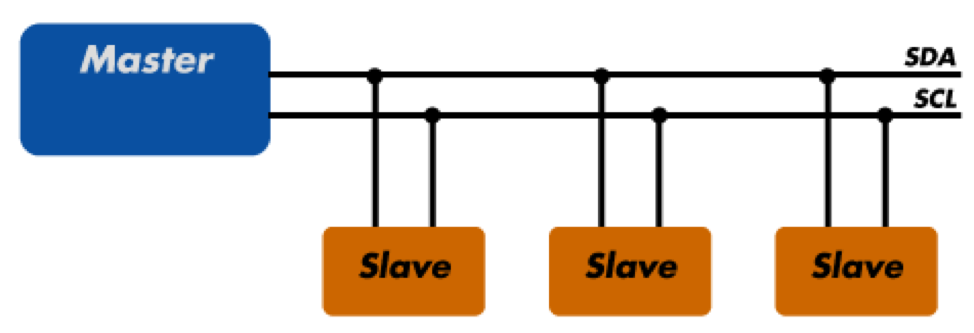
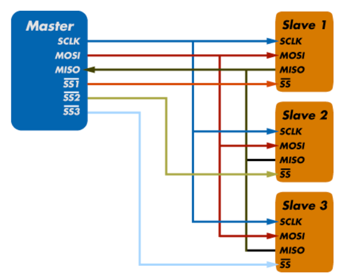
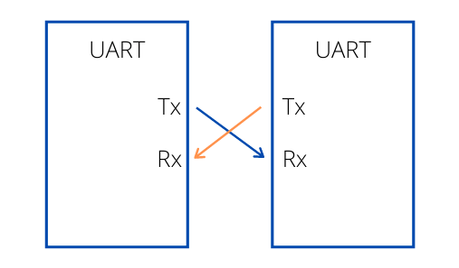
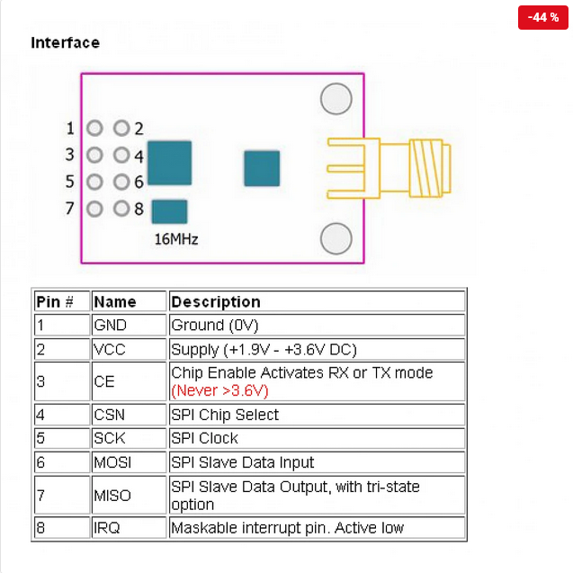

# Q3. Wired to Wireless Transition
## Part 1:

Tinkercad Simulation Link: https://www.tinkercad.com/things/hJXx0PbD9kD-keypad-lock-w-i2c?sharecode=zKGqKowhhnb580v_XUGaOyh4ySVN7WHeS4Rab2sz2Xc

**I2C Protocol**

I2C, or Inter-Integrated Circuit, is a simple communication protocol often used in embedded systems as a way to transfer data between a master (or multiple masters) and a single slave (or multiple slaves) device. It is a bidirectional two-wire serial bus that uses serial clock (SCL) and serial data (SDA) wires to send and manage data bit by bit between devices connected to the bus.

In I2C operations, the master controls the exchange of data between the devices. A master device will signal to a slave in order to send data or request a response. To accomplish this, all slave devices must have a unique address that is included in the I2C message.

When sending data over the bus, each I2C message includes an address frame of the slave device and one or more data frames containing the data being transmitted. The message also includes start and stop conditions, read/write bits from either the master or slave, and ACK/NACK bits sent from the receiver for error checking.

I2C is considered to be synchronous, meaning it operates using a serial clock. The clock is driven by the master device which allows the output of bits to be synchronized to the sampling of bits by the clock signal shared between the master and the slave.

The standard data transfer rate of the I2C protocol is 100 kbps, although data speeds of up to 5 Mbps are possible with I2C devices configured in "fast mode" or "ultra-fast mode".

**SPI**

SPI, or Serial Peripheral Interface, is a serial communication protocol often used in embedded systems for high-speed data exchanges between devices on the bus. It operates using a master-slave paradigm that includes at least four signals: a clock (SCLK), a master output/slave input (MOSI), a master input/slave output (MISO), and a slave select (SS) signal. The SCLK, MOSI, and MISO signals are shared by all devices on the bus. The SCLK signal is generated by the master device for synchronization, while the MOSI and MISO lines used for data exchange. Additionally, each slave device added to the bus has its own SS line. The master pulls low on a slave's SS line to select a device for communication.
Single SPI bus with 3 slaves

SPI communication supports full-duplex communication, meaning that both the master and slave can transmit data simultaneously.

The exchange itself has no pre-defined protocol which makes SPI ideal for data-streaming applications. It also has no maximum speed; data speeds in excess of 100 MHz have been achieved.

**UART**

UART, or Universal Asynchronous Receiver/ Transmitter, is a physical circuit in a microcontroller or single integrated circuit (IC) that is used to implement serial communication between devices in an embedded system. Essentially, a UART’s main purpose is to transmit and receive serial data.

In UART communication, two UARTs communicate directly with each other; the UART on the sender device, or the transmitting UART, receives parallel data from the CPU (microprocessor or microcontroller) and converts it to serial data. This serial data is transmitted to the UART on the receiver device, or the receiving UART. The receiving UART converts the received serial data back to parallel data and sends it to the CPU. In order for UART to convert serial-to-parallel and parallel-to-serial data, shift registers on the transmitting and receiving UART are used.

In UART communication, only two wires are required for communication: data flows from the Tx pin of the transmitting UART (Transmitter Tx) to the Rx pin of the receiving UART (Receiver Rx).
UART two-wire diagram

UART data is sent over the bus in the form of a packet. A packet consists of a start bit, data frame, a parity bit, and stop bits. The parity bit is used as an error check mechanism to help ensure data integrity.

UART is considered to be “universal” because the parameters including transfer speed and data speed are configurable by the developer. UART supports bidirectional data transmission, including half-duplex and full-duplex operations. It is also asynchronous, meaning it doesn’t use a clock signal to synchronize the output bits from the transmitting UART to the sampling bits on the receiving UART. Without a clock, the receiving and transmitting UART need to be on the same baud rate, or bit rate. This allows the system to know where and when the bits have been clocked.

**CAN**

Low-Cost, Lightweight Network

CAN provides an inexpensive, durable network that helps multiple CAN devices communicate with one another. An advantage to this is that electronic control units (ECUs) can have a single CAN interface rather than analog and digital inputs to every device in the system. This decreases overall cost and weight in automobiles.  
Broadcast Communication

Each of the devices on the network has a CAN controller chip and is therefore intelligent. All devices on the network see all transmitted messages. Each device can decide if a message is relevant or if it should be filtered.  This structure allows modifications to CAN networks with minimal impact.  Additional non-transmitting nodes can be added without modification to the network.
Priority

Every message has a priority, so if two nodes try to send messages simultaneously, the one with the higher priority gets transmitted and the one with the lower priority gets postponed.  This arbitration is non-destructive and results in non-interrupted transmission of the highest priority message.  This also allows networks to meet deterministic timing constraints.
Error Capabilities

The CAN specification includes a Cyclic Redundancy Code (CRC) to perform error checking on each frame's contents.  Frames with errors are disregarded by all nodes, and an error frame can be transmitted to signal the error to the network.  Global and local errors are differentiated by the controller, and if too many errors are detected, individual nodes can stop transmitting errors or disconnect itself from the network completely.

**RS-485/232**

RS-232 and RS-485 are both standards for serial communication, but they have different characteristics and applications.

## Part 2:
going wireless

1. Diving into wireless communication protocols

nRF (nRF24L01+):
    Best For: Short-range, low-power, high-speed data transfer (up to 2 Mbps).
    Range: Approx. 100 meters in open spaces.
    Frequency: 2.4 GHz
    Reliability: moderate interference in 2.4 GHz band.
    Pros: Extremely cheap and simple to use.

LoRa (SX1276/78/Ra-02):
    Best For: Very long-range, low-power, low-data rate communication
    Range: Up to 4.8 km in urban areas, 16+ km in rural areas.
    Frequency: <1 GHz
    Reliability: Excellent for long distances with low interference.
    Pros: Excellent penetration through obstacles and high resistance to interference.

XBee (Digi International):
    Best For: Robust, secure, and flexible mesh networking (Zigbee) or long-range (900HP) point-to-multipoint links.
    Range: Varies greatly by model (up to several miles with high-power versions).
    Short Range (2.4 GHz):
      Zigbee, IEEE 802.15.4, DigiMesh, Bluetooth Low Energy
    Long Range (868/900 MHz):
      Point-to-Point, Star topology, DigiMesh

2. Choosing the right module

>_"The course will be laid out on grass over an area of approximately 100 meters long by 100 meters wide and be 2,000 feet in length."_ - http://www.igvc.org/rules.html

For our bot we dont need mesh networking, considering the need for reliable and fast control over a moderate distance, the nRF24L01+/nRF24L01 module is a suitable choice due to its good enough range, high data rate, and low power consumption. It is also cost-effective and easy to implement.

We only want a simple tranceiver component as we have a main MCU controlling the bot and another MCU on the controller side;

**nRF24L01 (original)**
- Basic 2.4 GHz transceiver
- Supports 1 Mbps & 2 Mbps data rates only
- Short range & limited sensitivity compared with + version

**nRF24L01+ (standard choice)** 
- Better range/stability at low speed
- Better overall

**nRF24L01+ PA/LNA modules**
- Have a Power Amplifier + Low Noise Amplifier and external antenna

going with nRF24L01+ PA/LNA module (2.4GHz NRF24L01 PA LNA SMA Wireless Transceiver Antenna) for best range and reliability.

Common Problems in Wireless Emergency Communication
1. Interference: Other wireless devices, physical obstacles, and environmental factors can interfere with the signal, leading to loss of communication.

2. Signal Loss/ Dropouts: Inconsistent signal strength can lead to temporary loss of communication, which can be critical in emergency situations.

3. Latency: Delays in signal transmission can affect the responsiveness of the emergency stop function.

4. MCU crash/software freeze: If the microcontroller controlling the wireless module crashes, it may not be able to send or receive the emergency stop signal.

5. Noise to false triggers: Electrical noise or interference can cause false triggers of the emergency stop function, leading to unintended stoppages.

#### Wi-Fi
is a wireless networking technology using radio waves to connect devices to a router and the internet without cables
- Handles how bits travel over radio waves
Manages channels, retransmissions, collisions

#### IP (Internet Protocol)
is a network layer protocol that routes data packets between devices on different networks
Gives every device an IP address (like a phone number)
Example: 192.168.4.1
Used to identify sender and receiver

|TCP | UDP|
| :---: | :---: |
|Transmission Control Protocol|User Datagram Protocol|
|Secure	|Unsecure |
|Slower	|Faster |
|Ensures delivery	|No delivery guarantee |
|Retransmits lost packets	|Fire-and-forget |
|Higher latency	|Lower latency |

For robots:

TCP = slow but safe

UDP = fast but risky

Emergency stop systems would never use TCP.

4️⃣ How ESP32 Uses Wi-Fi

ESP32 can operate in multiple modes:

1. Station Mode (STA)
    ESP32 connects to a router
    Gets an IP address
    Communicates over network
>Bad for competition (router dependency)

2. Access Point Mode (AP)
    ESP32 creates its own Wi-Fi network
    Remote connects directly to it
    No router needed

✔ Better, but still has overhead

#### ESP-NOW
Proprietary Espressif protocol
No IP, no TCP, no router
P2P, MAC-address based
Very low latency

ESP-NOW is the only Wi-Fi-based option worth considering for emergency control.
