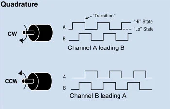

# Q3. Are We There Yet?
## Part A:
1. Compare incremental and absolute encoders, their impact on odometry accuracy, and how they improve your implementation.

**Incremental Encoders:**
- Provide relative position information by generating pulses as the shaft rotates.
- Require a reference point to determine absolute position.
- Susceptible to cumulative errors over time due to missed pulses or slippage.
- Simpler and often more cost-effective.

**Absolute Encoders:**
- Provide unique position information at any given time without needing a reference point. (retains position even after power loss)
- Use unique codes for each position, allowing for immediate position reading.
- Offer higher accuracy for odometry as they eliminate cumulative errors.
- More complex and typically more expensive.

Converting encoder readings to actual velocity
encoder ticks to revolutions
$$
\text{revolutions} = \frac{\text{encoder ticks}}{\text{ticks per revolution}}
$$
revolutions to distance
$$
\text{distance} = \text{revolutions} \times 2 \pi r
$$
distance to velocity
$$
WL_{actual} = \frac{\text{distance left wheel}}{\Delta t}
\\
WR_{actual} = \frac{\text{distance right wheel}}{\Delta t}
$$
$$
v_{actual} = \frac{WL_{actual} + WR_{actual}}{2}
\\
\omega_{actual} = \frac{WR_{actual} - WL_{actual}}{L}
$$

2. While encoders are essential, they are not foolproof. Discuss factors that introduce errors in encoder odometry.

Odometry = integrate wheel rotation over time
Factors introducing errors:

Why encoder odometry is NOT foolproof 🚨

Even with perfect encoders, errors creep in.

1.  Mechanical sources
- Wheel slip (biggest enemy)
- Uneven floor / dust / bumps
- Wheel wear → effective radius change
- Gear backlash & compliance
- Misalignment between wheels

2. Encoder-related issues
- Missed pulses at high RPM
- Electrical noise (poor pull-ups, long wires)
- Low sampling frequency

3. Modeling & assumptions
- Assuming pure rolling (no slip)
- Assuming identical wheel diameters
- Ignoring load-dependent deformation

4. Time & integration errors
- Small velocity errors accumulate
- Clock drift / inconsistent Δt

Result:
Encoder odometry drifts, even if encoders are perfect.

That’s why:
Sensor fusion is key:
IMU (gyro) corrects heading drift
Vision / beacons / markers reset pose occasionally

3. Given is some recorded pulse data by using a Teensy. Find the RPM of the motor at different time windows (Encoder resolution = 600 PPR)

Resolution: 600 PPR (Pulses Per Revolution)
$$RPM = \frac{Pulses counted}{PPR}\times \frac{60}{\Delta t}$$
$$RPM = \frac{\Delta Encoder Count}{600}\times \frac{60}{0.1}$$
$$$$RPM = \Delta Encoder Count \times 1$$

|Time (ms) | Encoder Count|rpm in the last interval|
|----------|---------------|----------------------|
|0|1200|
|100|1260|60|
|200|1320|60|
|300|1380|60|
|400|1470|90|
|500|1560|90|
|600|1650|90|
|700|1680|30|
|800|1710|30|
|900|1740|30|
|1000|1770|30|

### QEI and Quadrature Encoders
A quadrature encoder is a type of incremental encoder that uses two output signals (A and B) to provide information about the position and direction of rotation.

They signals are square waves of the same frequency; thus, digital

The signals are in "quadrature" phase:
ie one signal leads the other by 90degrees. This lets us detect direction, not just speed.

> What does 90degrees phase mean?
It means that when one signal transitions (rising or falling edge), the other signal is at its midpoint (either high or low). This phase difference allows the detection of the direction of rotation.

Direction of rotation:
Clockwise: A leads B
Counter-clockwise: B leads A

>single-channel encoders cannot detect direction reliably.

#### QEI (Quadrature Encoder Interface)
it is a hardware peripheral (inside MCUs) that interprets the signals from a quadrature encoder. It counts the pulses and determines the direction of rotation based on the phase relationship between the A and B signals.

It has several decoding modes:
- 1X Decoding: counts only the rising edge of channel A: n counts per revolution.
- 2X Decoding: counts both rising and falling edges of channel A: 2n counts per revolution.
- 4X Decoding: counts both rising and falling edges of both channels A and B (most accurate): 4n counts per revolution.

## Part B:
We have been given a 500 PPR motor and we do X4 decoding
1. What is the effective resolution in terms of PPR?
Effective PPR = 500 PPR * 4 = 2000 PPR

1. What is the first timestamp where the motor is rotating in the anticlockwise direction?
2. Plot the values of omega in every 50 ms window.
3. What kind of window should we prefer for measurement: a longer one or a shorter one? Give a reason

## Part C:

1. What is Odometry? Explain Wheel Odometry in depth.

odometry is the measurement of change in position over time. It is used in robotics to estimate the position and orientation of a robot based on the data from its motion sensors.

Wheel odometry refers to the process of estimating a robot's position and orientation by counting the rotations of its wheels (using encoder ticks) and applying kinematic equations.

They provide valuable data for estimating the robots movements, especially in environments where GPS or external tracking systems are unavailable.

2. Explain the main errors that occur during Wheel Odometry in detail.

3. Now that you know that wheel odometry is not the most reliable way for odometry, suggest other methods for odometry and tell us how we can implement all of them together in detail

In advanced navigation systems, wheel odometry is often combined with other sensors (like IMUs, GPS, or vision systems) to improve accuracy and reduce drift over time.

